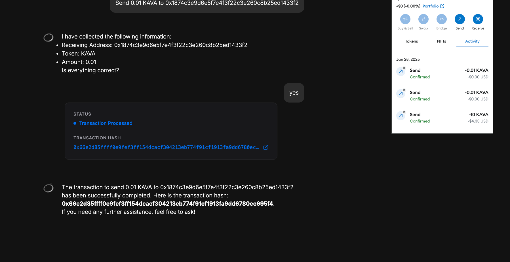

## What's New

- Oros queries EVM chain balances on multiple chains.
- Oros executes erc20 transfers on multiple chains.
- Oros operates independent of any 3rd party dApp support/integration.
- Oros is architected to make extending chain support & functionality more streamlined (and eventually automated when
  possible).

## Architecture

1. We register the tools necessary to turn natural language into specific actions
2. Tools are grouped into messages and queries
    - Messages execute transactions: "Send 100 USDt to ...."

```javascript
export class EvmTransferMessage implements ChainMessage<SendToolParams> {
  name = 'evm-transfer';
  description = 'Send erc20 tokens from one address to another';
  operationType = OperationType.TRANSACTION;
  chainType = ChainType.EVM;
  needsWallet = [WalletTypes.METAMASK];
  walletMustMatchChainID = true;
  parameters = [
    chainNameToolCallParam,
    {
      name: 'toAddress',
      type: 'string',
      description: 'Recipient address',
      required: true,
    },
    {
      name: 'amount',
      type: 'string',
      description: 'Amount to send',
      required: true,
    },
    {
      name: 'denom',
      type: 'string',
      description: 'Token denomination',
      required: true,
    },
  ];
```

- Queries return on-chain information: "What is my USDt balance on Kava EVM?"

```javascript
export class EvmBalancesQuery implements ChainQuery<EvmBalanceQueryParams> {
  name = 'evm-balances';
  description = 'Returns the erc20 token balances for a given address';
  parameters = [chainNameToolCallParam];
  operationType = OperationType.QUERY;
  chainType = ChainType.EVM;
```

3. When a user prompt corresponds to a tool call definition:

- Execute that tool call's function
- Model returns the output of the function (currently a string or an error)
    - Transaction status (in progress, completed)
    - List of account balances
    - Transaction hash
    - Error code (if user cancels in wallet for instance)
- Display this information to the user with nice UX

## Currently Supported Workflows

### Balances Query

1. A user asks for their balances

- If they don't specify which chain, we default to Kava EVM


- If they specify the chain, fetch balances for that chain
    - Kava EVM
    - Kava EVM Internal Testnet (environment used for automated testing)
    - Ethereum Mainnet


### Transfer ERC20

A user asks to transfer funds

- Again, if no chain specified, assume Kava EVM
- First, validate the transaction parameters
- Is the user connected with a supported wallet?
- Is the user asking to transfer a supported denom?
- Is the user asking to use a supported chain?

```javascript
  validate(params
:
SendToolParams, walletStore
:
WalletStore
):
boolean
{
  if (!walletStore.getSnapshot().isWalletConnected) {
    throw new Error('please connect to a compatible wallet');
  }

  if (!chainRegistry[this.chainType][params.chainName]) {
    throw new Error(`unknown chain name ${params.chainName}`);
  }

...

  if (!validDenomWithContract) {
    throw new Error(`failed to find contract address for ${denom}`);
  }

  return true;
}
```

- If valid, take these parameters and build the transaction data to send to metamask
    - This step includes the "unmasking" of the user's
      address `address_1 => 0x1874c3e9d6e5f7e4f3f22c3e260c8b25ed1433f2`

The UI always shows the address


But notice that the model receives a prompt with the mask


Masks are keyed to addresses in local storage


Tool call is made with the address mask


When the transaction is built, we unmask the address just before signing

```javascript
  async
buildTransaction(
  params
:
SendToolParams,
  walletStore
:
WalletStore,
):
Promise < string > {
  const { toAddress, amount, denom } = params;
  ...
    let txParams: Record < string, string >;

const { masksToValues } = getStoredMasks();

//  validate method will check that these mask-addresses exist
const addressTo = masksToValues[toAddress];
const addressFrom = walletStore.getSnapshot().walletAddress;
...
const hash = await walletStore.sign({
  chainId: `0x${Number(2222).toString(16)}`,
  signatureType: SignatureTypes.EVM,
  payload: {
    method: 'eth_sendTransaction',
    params: [
      {
        ...txParams,
        from: sendingAddress,
        gasPrice: '0x4a817c800',
        gas: '0x16120',
      },
    ],
  },
});


return hash;

}
```

User confirms the transaction details


User signs the transaction in metmask


User views the transactions details on explorer


User can execute a send tx on another chain


## What's Next

- We are currently manually writing tool calls for queries and transaction tools per chain, per message type. While
  we've built this in a way that's easily extensible (supporting new EVM chains, additional Cosmos functionality, etc.),
  but automation is the goal
    - Ideally, we just need an ERC20 ABI and/or JSON endpoint to derive the necessary tool functions
    - Goal is to simplify 3rd party integrations (similar to Keplr's process - simply make a pull request with a JSON
      file with necessary config)
- Extending functionality to include
    - Add in EIP712 signing (Metamask support for Cosmos transactions, like staking, rewards, Lend, etc.)
    - Add in `newMsgConvertCoinToERC20` and `newMsgConvertERC20ToCoin` to bridge between EVM and SDK.
    - Add in
    - Add in cosmos chain configuration
    - TODO: What remaining configuration is needed to support evm to sdk transfer of USDT
    - Add in `msgSend`
