# Oros Demo (1/28/2025)

## What's New

- **Multi-Chain Balance Queries:** Oros now supports querying EVM chain balances across multiple chains.
- **Multi-Chain ERC20 Transfers:** Execute ERC20 token transfers on multiple chains.
- **Independent Operation:** Oros operates independently of third-party dApp support or integrations.
- **Streamlined Architecture:** Built to support additional chains and transactions with ease, paving the way for
  automation when possible.

---

## Architecture

### Overview

1. **Tool Registration:**  
   Tools are registered to translate natural language prompts into specific actions.

2. **Tool Categories:**

   **Messages:** Execute transactions. Example: *"Send 100 USDt to ..."*

```typescript
export class EvmTransferMessage implements ChainMessage<SendToolParams> {
  name = 'evm-transfer';
  description = 'Send erc20 tokens from one address to another';
  operationType = OperationType.TRANSACTION;
  chainType = ChainType.EVM;
  needsWallet = [WalletTypes.METAMASK];
  walletMustMatchChainID = true;
  parameters = [
    chainNameToolCallParam,
    {
      name: 'toAddress',
      type: 'string',
      description: 'Recipient address',
      required: true,
    },
    {
      name: 'amount',
      type: 'string',
      description: 'Amount to send',
      required: true,
    },
    {
      name: 'denom',
      type: 'string',
      description: 'Token denomination',
      required: true,
    },
  ];
```

**Queries:** Retrieve on-chain information. Example: *"What is my USDt balance on Kava EVM?"*

```javascript
export class EvmBalancesQuery implements ChainQuery<EvmBalanceQueryParams> {
  name = 'evm-balances';
  description = 'Returns the erc20 token balances for a given address';
  parameters = [chainNameToolCallParam];
  operationType = OperationType.QUERY;
  chainType = ChainType.EVM;
```

3. When a user prompt corresponds to a tool call definition:

- Execute that tool call's function
    - Messages call `validate` method, then `buildTransaction`
    - Queries call `executeQuery`
- Model returns the output of the function (currently a string or an error)
    - Transaction status (in progress, completed)
    - List of account balances
  - Transaction hash
    - Error code (if user cancels in wallet for instance)
- Display this information to the user with nice UX (use the tx hash to build an explorer link, etc.)

---
## Currently Supported Workflows

### Balances Query

1. A user asks for their balances

- If they don't specify which chain, we default to Kava EVM

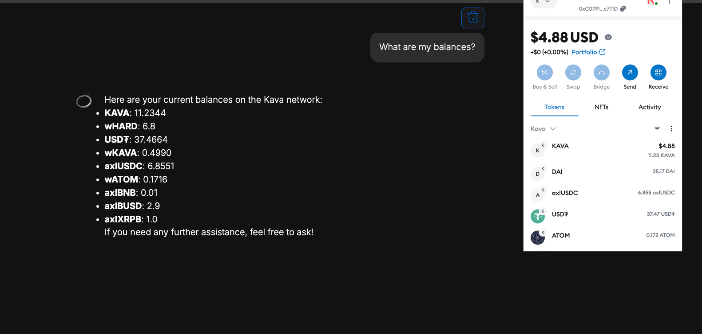

- If they specify the chain, fetch balances for that chain
    - Kava EVM
    - Kava EVM Internal Testnet (environment used for automated testing)
    - Ethereum Mainnet

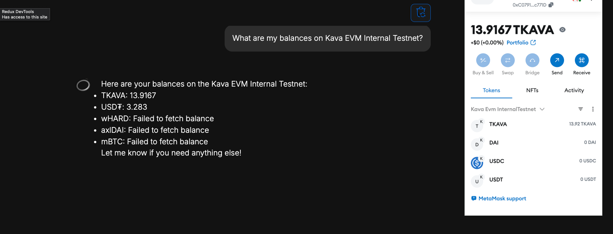

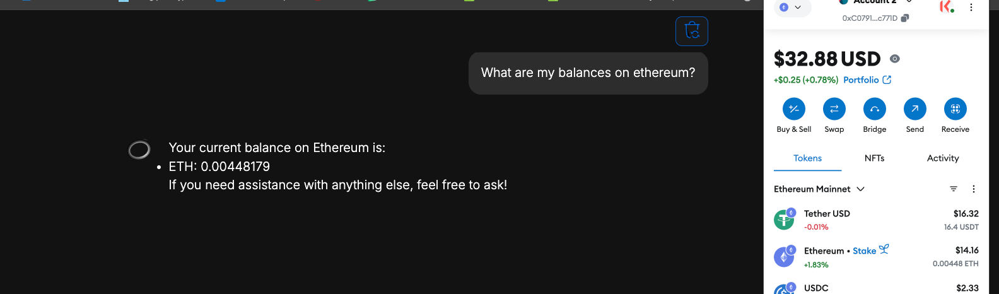

### Transfer ERC20

A user asks to transfer funds

- Again, if no chain specified, assume Kava EVM
- First, validate the transaction parameters
- Is the user connected with a supported wallet?
- Is the user asking to transfer a supported denom?
- Is the user asking to use a supported chain?

```
validate(params: SendToolParams, walletStore: WalletStore): boolean {
  if (!walletStore.getSnapshot().isWalletConnected) {
    throw new Error('please connect to a compatible wallet');
  }

  if (!chainRegistry[this.chainType][params.chainName]) {
    throw new Error(`unknown chain name ${params.chainName}`);
  }

  if (!validDenomWithContract) {
    throw new Error(`failed to find contract address for ${denom}`);
  }

  return true;
}
```

- If valid, take these parameters and build the transaction data to send to metamask
    - This step includes the "unmasking" of the user's
      address `address_1 => 0x1874c3e9d6e5f7e4f3f22c3e260c8b25ed1433f2`

The UI always shows the address
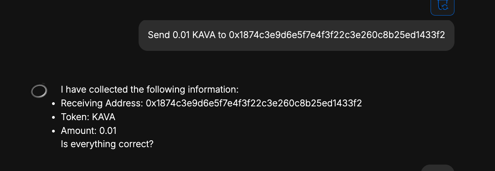

But notice that the model receives a prompt with the mask
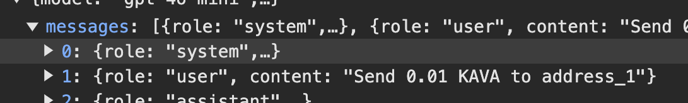

Masks are keyed to addresses in local storage
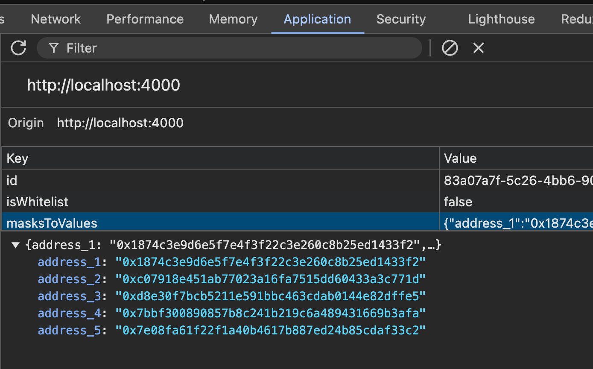

Tool call is made with the address mask
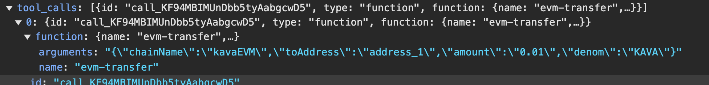

When the transaction is built, we unmask the address just before signing

```typescript
async buildTransaction(params: SendToolParams, walletStore: WalletStore): Promise<string> {
  const { toAddress, amount, denom } = params;

  const { masksToValues } = getStoredMasks();

  const addressTo = masksToValues[toAddress];
  const addressFrom = walletStore.getSnapshot().walletAddress;
  const txParams = {
    to: receivingAddress,
    data: '0x',
    value: ethers.parseEther(amount).toString(16),
  };

  const hash = await walletStore.sign({
    chainId: `0x${Number(2222).toString(16)}`,
    signatureType: SignatureTypes.EVM,
    payload: {
      method: 'eth_sendTransaction',
      params: [
        {
          ...txParams,
          from: sendingAddress,
          gasPrice: '0x4a817c800',
          gas: '0x16120',
        },
      ],
    },
  });
}


return hash;

}
```

User confirms the transaction details in the chat and is notified the tx is in progress
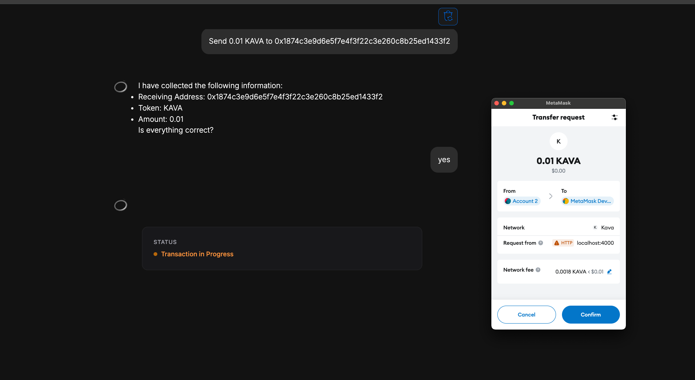

If a user cancels the transaction in metamask, that info is returned to Oros
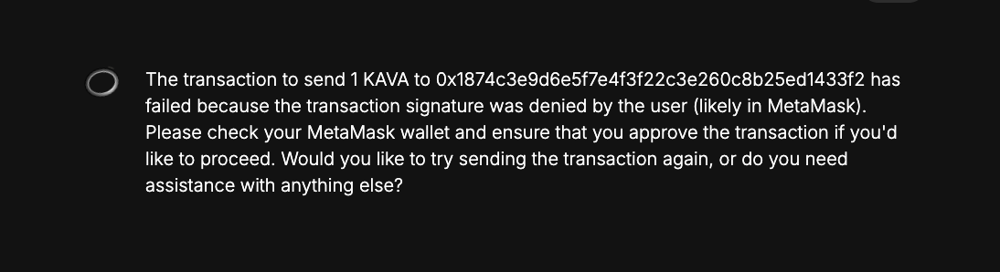

If a user signs in metamask, they will see when the transaction is completed
The tool call returns a tx hash, which is turned into an explorer link
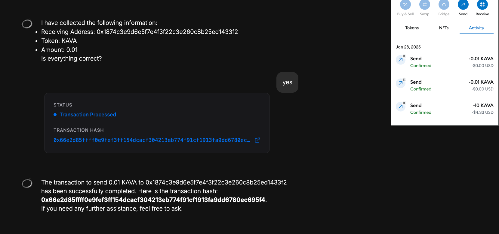

User views the transactions details on explorer
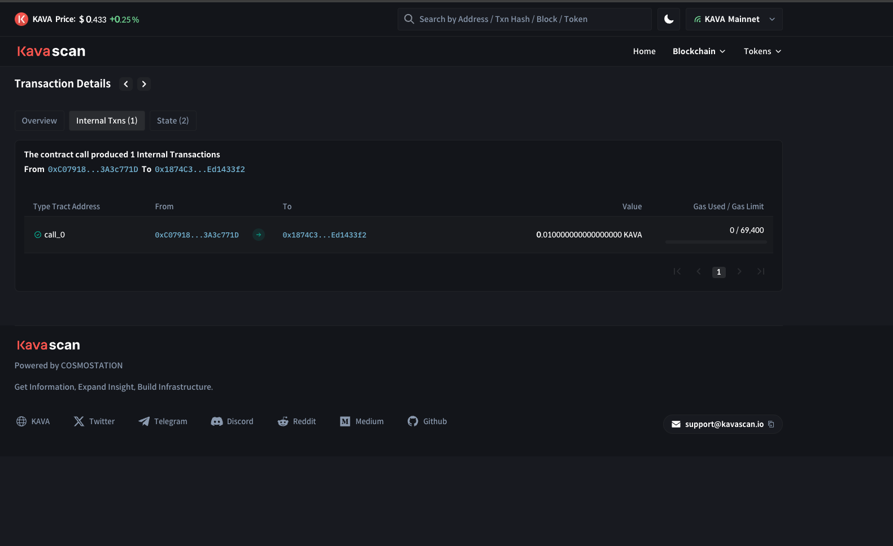

User can execute a send tx on another chain
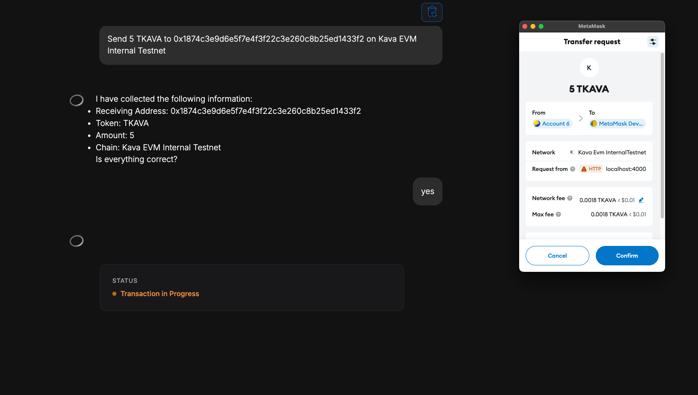

User can use Oros embedded within a dApp
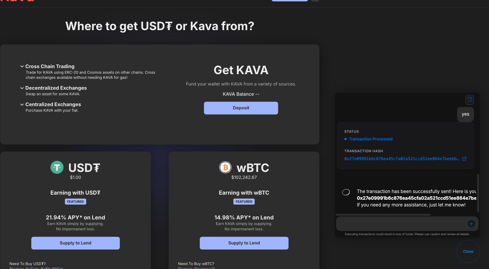

## What's Next

- We are currently manually writing tool calls for queries and transaction tools per chain, per message type. While
  we've built this in a way that's easily extensible (supporting new EVM chains, additional Cosmos functionality, etc.),
  automation is the goal
    - Ideally, we just need an ERC20 ABI and/or JSON endpoint to derive the necessary tool functions
  - Goal is to simplify 3rd party integrations (similar to Keplr's process - simply make a pull request to a JSON
      file with necessary config)
- Extending functionality to include
    - Add in `newMsgConvertCoinToERC20` and `newMsgConvertERC20ToCoin` to bridge USDt between EVM and SDK.
    - Add in EIP712 signing (Metamask support for Cosmos transactions, like Lend, staking, rewards, etc.)
    - Add in cosmos chain configuration
- We've configured this as an iFrame integration and as a standalone URL. What adjustments need to be made to make this
  a browser extension? 
