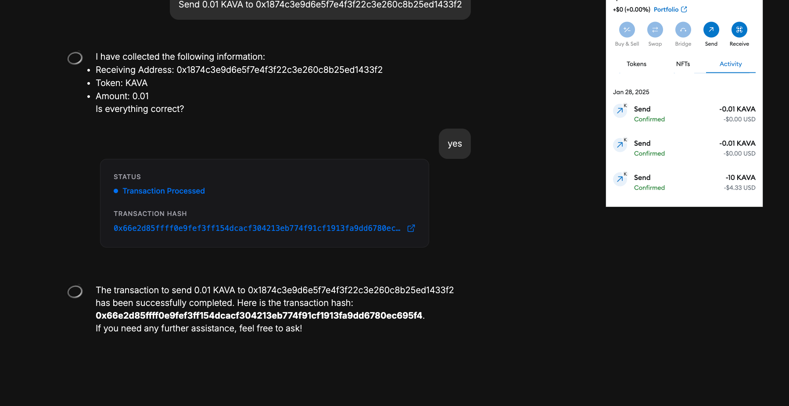

## What's New

- Oros queries EVM chain balances & executes erc20 transfers independent of any 3rd party dApp support
- Updated architecture to make extending chain support & functionality more streamlined and automated when possible.

## Architecture

- We register the tools necessary to turn natural language into specific actions
- Tools are grouped into messages and queries
    - Messages execute transactions: "Send 100 USDt to ...."
    - Queries return on-chain information: "What is my USDt balance on Kava EVM?"
- When a user prompt corresponds to a tool call definition:
      - Execute that tool call's function
    - Receive a response (list of token balances, transaction
      hash, etc.)
        - Transaction status (in progress, completed)
        - List of account balances
        - Transaction hash
        - Error code (if user cancels in wallet for instance)
    - Display this information to the user with nice UX

## Currently Supported Workflows

### Balances Query

A user asks for their balances
If they don't specify which chain, we default to Kava EVM


If they specify the chain, fetch balances for that chain (currently a small, hardcoded list)


### Transfer ERC20

A user asks to transfer funds
    - Again, if no chain specified, assume Kava EVM
    - First, validate the transaction parameters
        - Is the user connected with a supported wallet?
        - Is the user asking to transfer a supported denom?
        - Is the user asking to use a supported chain?

```javascript
  validate(params: SendToolParams, walletStore: WalletStore): boolean {
    if (!walletStore.getSnapshot().isWalletConnected) {
      throw new Error('please connect to a compatible wallet');
    }

    if (!chainRegistry[this.chainType][params.chainName]) {
      throw new Error(`unknown chain name ${params.chainName}`);
    }

    ...

    if (!validDenomWithContract) {
      throw new Error(`failed to find contract address for ${denom}`);
    }

    return true;
  }
```

- If valid, take these parameters and build the transaction data to send to metamask
        - This step includes the "unmasking" of the user's
  address `address_1 => 0x1874c3e9d6e5f7e4f3f22c3e260c8b25ed1433f2`

The UI always shows the address


But notice that the model receives a prompt with the mask


Masks are keyed to addresses in local storage


Tool call is made with the address mask


When the transaction is built, we unmask the address just before signing

```
  async buildTransaction(
    params: SendToolParams,
    walletStore: WalletStore,
  ): Promise<string> {
    const { toAddress, amount, denom } = params;
    ...
      let txParams: Record<string, string>;

      const { masksToValues } = getStoredMasks();

      //  validate method will check that these mask-addresses exist
      const addressTo = masksToValues[toAddress];
      const addressFrom = walletStore.getSnapshot().walletAddress;
    ...
      const hash = await walletStore.sign({
        chainId: `0x${Number(2222).toString(16)}`,
        signatureType: SignatureTypes.EVM,
        payload: {
          method: 'eth_sendTransaction',
          params: [
            {
              ...txParams,
              from: sendingAddress,
              gasPrice: '0x4a817c800',
              gas: '0x16120',
            },
          ],
        },
      });


      return hash;
 
  }
```

User confirms the transaction details


User signs the transaction in metmask


User views the transactions details on explorer


